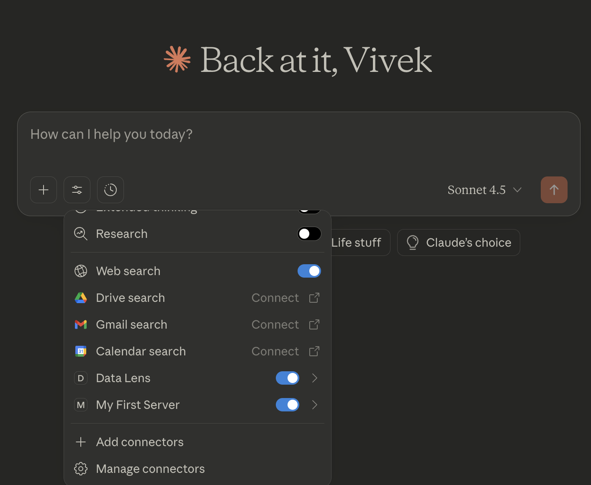
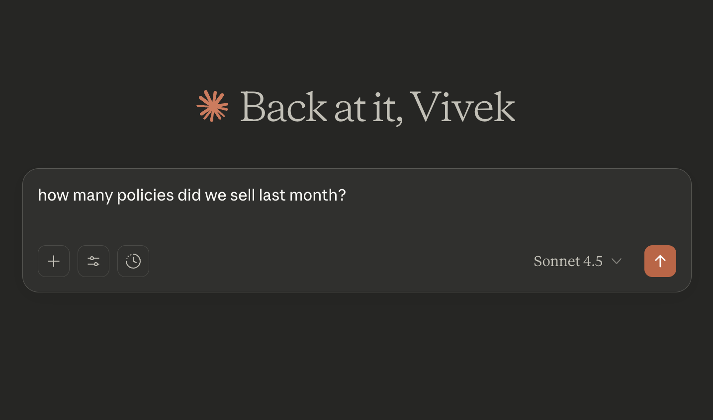
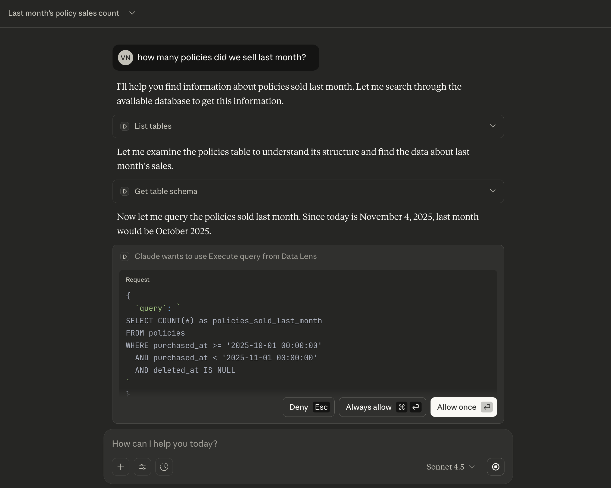
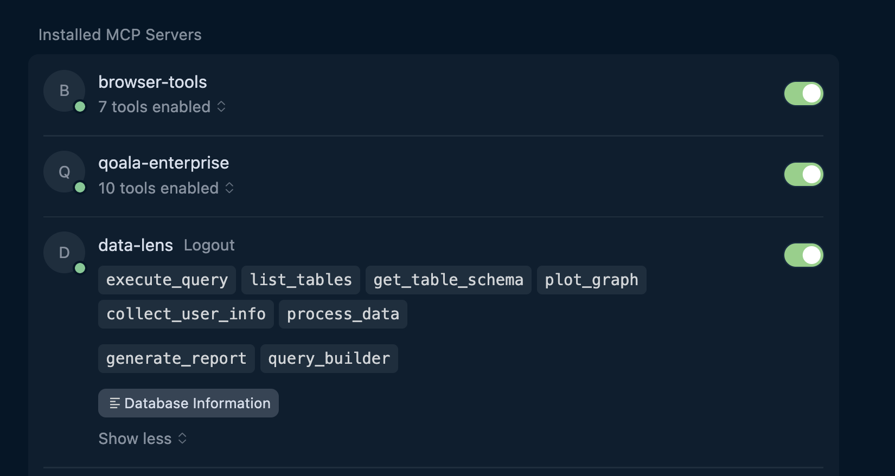

# 🔍 MCP Data Lens

> A powerful FastMCP server for MySQL database analytics with SSH tunnel support, data visualization, and AI-powered insights.

[](https://www.python.org/downloads/)
[](https://github.com/jlowin/fastmcp)
[](https://opensource.org/licenses/MIT)

## ✨ Features

### 🔐 Secure Database Access
- **SSH Tunnel Support**: Connect to remote MySQL databases securely through SSH tunnels
- **Read-Only Enforcement**: Built-in query validation ensures only SELECT, SHOW, DESCRIBE, and EXPLAIN queries are executed
- **Connection Pooling**: Efficient database connection management for optimal performance

### 📊 Data Analytics & Visualization
- **SQL Query Execution**: Execute read-only queries with structured results
- **Schema Inspection**: Explore database tables, columns, indexes, and statistics
- **Data Visualization**: Create beautiful charts (bar, line, pie, scatter) directly from query results
- **Report Generation**: AI-assisted comprehensive data analysis reports

### 🛠️ MCP Protocol Features
- **Tools**: Execute queries, inspect schemas, and create visualizations
- **Resources**: Expose database information via URIs
- **Prompts**: Pre-built templates for reports and query generation
- **Middleware**: Tag-based access control for enhanced security

### 🚀 Flexible Deployment
- **Stdio Mode**: Native integration with Claude Desktop
- **HTTP Mode**: REST API for web applications and other clients
- **OAuth Authentication**: Google OAuth 2.0 support for secure access
- **Modular Architecture**: Clean, maintainable code structure

## 📋 Table of Contents

- [Installation](#-installation)
- [Configuration](#-configuration)
  - [OAuth Authentication Setup](#oauth-authentication-setup)
- [Usage](#-usage)
  - [With Claude Desktop](#with-claude-desktop)
  - [With Cursor](#with-cursor)
  - [As HTTP Server](#as-http-server)
- [Available Tools](#-available-tools)
- [Resources](#-resources)
- [Prompts](#-prompts)
- [Architecture](#-architecture)
- [Development](#-development)
  - [Using the Makefile](#using-the-makefile)
  - [Adding New Tools](#adding-new-tools)
  - [Adding New Resources](#adding-new-resources)
  - [Testing with MCP Inspector](#testing-with-mcp-inspector)
- [Examples](#-examples)
- [Troubleshooting](#-troubleshooting)
- [Contributing](#-contributing)
- [License](#-license)

## 🚀 Installation

### Prerequisites

- Python 3.11 or higher
- MySQL database (local or remote)
- SSH access to database server (if using SSH tunnel)
- [uv](https://github.com/astral-sh/uv) package manager

### Installation Steps

```bash
# Install uv if you haven't already
curl -LsSf https://astral.sh/uv/install.sh | sh

# Clone the repository
git clone https://github.com/yourusername/mcp-data-lens.git
cd mcp-data-lens

# Quick setup with Makefile (recommended)
make setup

# Or install dependencies manually with uv (uses uv.lock)
uv sync

# Or create a virtual environment and install manually
uv venv
source .venv/bin/activate  # On Windows: .venv\Scripts\activate
uv pip install -e .
```

### Quick Start with Makefile

The project includes a comprehensive Makefile for common tasks:

```bash
# See all available commands
make help

# Complete setup (install deps + create .env)
make setup

# Run in stdio mode (Claude Desktop)
make run-stdio

# Run in HTTP mode
make run-http

# Run tests
make test

# Format and lint code
make fix

# Run all checks
make check
```

## ⚙️ Configuration

### Environment Variables

Create a `.env` file in the project root:

```bash
# Transport Mode
TRANSPORT_MODE=stdio  # or "http"

# SSH Tunnel Configuration (optional)
USE_SSH_TUNNEL=true
SSH_HOST=your-ssh-server.com
SSH_PORT=22
SSH_USER=your-username
SSH_KEY_PATH=~/.ssh/id_rsa  # or use SSH_PASSWORD
# SSH_PASSWORD=your-password  # Alternative to key-based auth

# Database Configuration
DB_HOST=localhost  # or remote host if not using SSH tunnel
DB_PORT=3306
DB_USER=your-db-user
DB_PASSWORD=your-db-password
DB_NAME=your-database-name

# SSH Tunnel Local Binding (if using SSH tunnel)
LOCAL_BIND_PORT=3306

# HTTP Server Configuration (if TRANSPORT_MODE=http)
SERVER_HOST=0.0.0.0
SERVER_PORT=8000

# OAuth Authentication (Google)
AUTH_ENABLED=false
AUTH_SECRET_KEY=change-me-in-production
GOOGLE_CLIENT_ID=your-google-client-id.apps.googleusercontent.com
GOOGLE_CLIENT_SECRET=your-google-client-secret
```

### Configuration Options Explained

| Variable | Description | Default |
|----------|-------------|---------|
| `TRANSPORT_MODE` | Server mode: `stdio` for Claude Desktop, `http` for REST API | `stdio` |
| `USE_SSH_TUNNEL` | Enable SSH tunnel for database connection | `true` |
| `SSH_HOST` | SSH server hostname | - |
| `SSH_PORT` | SSH server port | `22` |
| `SSH_USER` | SSH username | - |
| `SSH_KEY_PATH` | Path to SSH private key | `~/.ssh/id_rsa` |
| `SSH_PASSWORD` | SSH password (alternative to key) | - |
| `DB_HOST` | MySQL host (localhost if using SSH tunnel) | `localhost` |
| `DB_PORT` | MySQL port | `3306` |
| `DB_USER` | MySQL username | `root` |
| `DB_PASSWORD` | MySQL password | - |
| `DB_NAME` | MySQL database name | - |
| `LOCAL_BIND_PORT` | Local port for SSH tunnel | `3306` |
| `SERVER_HOST` | HTTP server bind address | `0.0.0.0` |
| `SERVER_PORT` | HTTP server port | `8000` |
| `AUTH_ENABLED` | Enable OAuth authentication | `false` |
| `GOOGLE_CLIENT_ID` | Google OAuth 2.0 Client ID | - |
| `GOOGLE_CLIENT_SECRET` | Google OAuth 2.0 Client Secret | - |

### OAuth Authentication Setup

MCP Data Lens supports OAuth 2.0 authentication using Google as the identity provider. This is optional but recommended for production deployments.

#### Setting up Google OAuth

1. **Create a Google Cloud Project**:
   - Go to [Google Cloud Console](https://console.cloud.google.com/)
   - Create a new project or select an existing one

2. **Enable Google OAuth API**:
   - Navigate to "APIs & Services" → "Credentials"
   - Click "Create Credentials" → "OAuth client ID"
   - Configure OAuth consent screen if you haven't already

3. **Configure OAuth Client**:
   - Application type: "Web application"
   - Authorized redirect URIs: Add `http://localhost:8000/auth/callback` (adjust host/port as needed)
   - Copy the Client ID and Client Secret

4. **Update Environment Variables**:
   ```bash
   AUTH_ENABLED=true
   GOOGLE_CLIENT_ID=your-client-id.apps.googleusercontent.com
   GOOGLE_CLIENT_SECRET=your-client-secret
   ```

5. **Start the Server in HTTP Mode**:
   ```bash
   export TRANSPORT_MODE=http
   make run-http
   ```

#### OAuth Flow

When OAuth is enabled, the server exposes the following endpoints:

- `/.well-known/oauth-authorization-servers` - OAuth server metadata
- `/authorize` - Initiates the OAuth flow
- `/auth/callback` - Handles OAuth callback from Google

The authentication flow:
1. Client initiates login by visiting `/authorize`
2. User is redirected to Google for authentication
3. After successful authentication, Google redirects back to `/auth/callback`
4. Server validates the token and creates an authenticated session
5. Subsequent MCP requests include authentication headers


## 📖 Usage

### With Claude Desktop

1. **Configure Claude Desktop**: Add to your `claude_desktop_config.json`:

```json
{
  "mcpServers": {
    "data-lens": {
      "command": "uv",
      "args": [
        "--directory",
        "/absolute/path/to/mcp-data-lens",
        "run",
        "--with",
        "fastmcp",
        "--with",
        "mysql-connector-python",
        "--with",
        "matplotlib",
        "--with",
        "pandas",
        "--with",
        "paramiko==3.5.1",
        "--with",
        "sshtunnel",
        "--with",
        "uvicorn",
        "server.py",
      ],
      "env": {
        "TRANSPORT_MODE": "stdio"
      }
    }
  }
}
```

2. **Restart Claude Desktop**

3. **Start using the tools**:
   - Ask Claude to "List all tables in the database"
   - Request "Show me a bar chart of sales by category"
   - Generate reports with "Create a comprehensive report for the users table"


#### Claude MCP Server



#### Claude MCP Tools


#### Claude MCP Query



#### Claude MCP Execution




### With Cursor

Cursor supports HTTP-based MCP servers, making integration simple.

1. **Start the MCP server in HTTP mode**:

```bash
# Set environment to HTTP mode
export TRANSPORT_MODE=http

# Run the server
make run-http
# Or manually: uv run server.py
```

The server will start at `http://localhost:8000`

2. **Configure Cursor**: Add to your Cursor settings (Cursor Settings → Features → MCP):

```json
{
  "mcpServers": {
    "data-lens": {
      "url": "http://127.0.0.1:8000/mcp"
    }
  }
}
```

3. **Start using the tools**: Cursor will immediately detect the MCP server and show all available tools. You can now:
   - Ask Cursor to "List all tables in the database"
   - Request "Show me a bar chart of sales by category"
   - Generate reports with "Create a comprehensive report for the users table"
   - Use the MCP tools directly in your coding workflow

**Note:** Make sure the HTTP server is running before using MCP tools in Cursor. You can run it in the background or in a separate terminal.




### As HTTP Server

```bash
# Set environment
export TRANSPORT_MODE=http
# Or with uv
uv run server.py
```

The server will start at `http://localhost:8000` (or your configured host/port).

**Access the MCP endpoints at**: `http://localhost:8000/mcp`

## 🛠️ Available Tools

### 1. `execute_query`
Execute read-only SQL queries with structured results.

**Parameters:**
- `query` (string): SQL query to execute (SELECT, SHOW, DESCRIBE, EXPLAIN only)

**Returns:**
```json
{
  "success": true,
  "columns": ["id", "name", "email"],
  "rows": [
    {"id": 1, "name": "John Doe", "email": "john@example.com"},
    {"id": 2, "name": "Jane Smith", "email": "jane@example.com"}
  ],
  "row_count": 2
}
```

**Example:**
```sql
SELECT id, name, email FROM users WHERE status = 'active' LIMIT 10
```

---

### 2. `list_tables`
List all tables in the connected database.

**Returns:**
```json
{
  "success": true,
  "tables": ["users", "orders", "products"],
  "count": 3
}
```

---

### 3. `get_table_schema`
Get detailed schema information for a specific table.

**Parameters:**
- `table_name` (string): Name of the table to inspect

**Returns:**
```json
{
  "success": true,
  "table_name": "users",
  "columns": [
    {
      "Field": "id",
      "Type": "int",
      "Null": "NO",
      "Key": "PRI",
      "Default": null,
      "Extra": "auto_increment"
    }
  ],
  "indexes": [...],
  "row_count": 1000
}
```

---

### 4. `plot_graph`
Create data visualizations from query results.

**Parameters:**
- `query` (string): SQL SELECT query
- `chart_type` (string): Chart type - `bar`, `line`, `pie`, or `scatter`
- `x_column` (string): Column name for x-axis
- `y_column` (string): Column name for y-axis
- `title` (string, optional): Chart title

**Returns:** PNG image of the chart

**Example:**
```python
query = "SELECT category, SUM(sales) as total FROM products GROUP BY category"
chart_type = "bar"
x_column = "category"
y_column = "total"
title = "Sales by Category"
```

---

### 5. `collect_user_info`
Interactive tool that demonstrates MCP's elicitation capabilities. This tool collects user information through an interactive prompt, showcasing how MCP servers can request structured data from users.

**Purpose:**
- Demonstrates the `ctx.elicit()` context method
- Shows how to handle user responses (accept, decline, cancel)
- Example of collecting structured data using Pydantic models

**How it works:**
1. Presents an interactive form requesting name and age
2. User can accept, decline, or cancel the request
3. Returns personalized message based on user's action

**Returns:** 
- If accepted: `"Hello {name}, you are {age} years old"`
- If declined: `"Information not provided"`
- If cancelled: `"Operation cancelled"`

**Use cases:**
- Interactive data collection workflows
- User preference gathering
- Dynamic configuration during runtime

---

### 6. `process_data`
Process data from a resource with real-time progress reporting. This tool demonstrates MCP's progress tracking capabilities and resource reading.

**Parameters:**
- `data_uri` (string): URI of the resource to process (e.g., `mysql://schema/database`)

**Purpose:**
- Demonstrates the `ctx.report_progress()` context method
- Shows how to read resources programmatically with `ctx.read_resource()`
- Example of using `ctx.sample()` to leverage the client's LLM for data analysis
- Illustrates proper info/error logging with `ctx.info()` and `ctx.error()`

**How it works:**
1. Reads data from the specified resource URI
2. Reports progress at 50% completion
3. Attempts to generate an AI summary of the data using the client's LLM
4. Falls back to a simple preview if LLM is unavailable
5. Reports 100% completion
6. Returns structured response with data length, summary, and preview

**Returns:**
```json
{
  "length": 1024,
  "summary": "Database schema with 15 tables including users, orders...",
  "preview": "Database: myapp_production\nMySQL Version: 8.0.35..."
}
```

**Use cases:**
- Long-running data processing tasks
- Resource analysis and summarization
- Demonstrating progress feedback to users
- Multi-step workflows with status updates

## 📚 Resources

Resources expose database information via URIs.

### `mysql://schema/database`
Get comprehensive database information including:
- Database name and MySQL version
- Connection type (SSH Tunnel or Direct)
- List of all tables with statistics (row counts, sizes, engines)

**Example Output:**
```
Database: myapp_production
MySQL Version: 8.0.35
Connection: SSH Tunnel
Total Tables: 15

Tables:
Table                          Rows      Size (MB) Engine     Collation
------------------------------------------------------------------------------------------
users                        10,523        12.45    InnoDB     utf8mb4_unicode_ci
orders                       45,892        67.23    InnoDB     utf8mb4_unicode_ci
products                      2,341         8.91    InnoDB     utf8mb4_unicode_ci
```

## 💡 Prompts

Pre-built prompt templates for AI-assisted analysis.

### 1. `generate_report`
Generate comprehensive data analysis reports.

**Parameters:**
- `table_name` (string): Table to analyze
- `metrics` (string): Specific metrics to focus on (default: "all")

**Generates:**
- Executive summary
- Data distribution analysis
- Key insights and trends
- Actionable recommendations

---

### 2. `query_builder`
Generate optimized SQL queries for common tasks.

**Parameters:**
- `table_name` (string): Table to query
- `task` (string): Task type - `explore`, `aggregate`, `trend`, or `compare`
- `conditions` (string, optional): WHERE clause conditions

**Generates:** Optimized SQL query with best practices

## 🏗️ Architecture

### Project Structure

```
mcp-data-lens/
├── data_lens/
│   ├── config/
│   │   ├── __init__.py
│   │   └── settings.py          # Configuration management
│   ├── database/
│   │   ├── __init__.py
│   │   ├── connection.py        # Database connection & pooling
│   │   └── utils.py             # Query validation utilities
│   ├── mcp/
│   │   ├── __init__.py
│   │   ├── mcp.py               # Main MCP instance
│   │   ├── middleware/
│   │   │   ├── __init__.py
│   │   │   └── tag_middleware.py  # Access control middleware
│   │   ├── prompts/
│   │   │   ├── __init__.py
│   │   │   └── report_prompts.py  # Report & query prompts
│   │   ├── resources/
│   │   │   ├── __init__.py
│   │   │   └── database_resources.py  # Database info resources
│   │   └── tools/
│   │       ├── __init__.py
│   │       ├── elicit.py        # User info elicitation
│   │       ├── mysql.py         # MySQL query tools
│   │       ├── progress_tool.py # Progress tracking
│   │       └── visualization.py # Chart generation
│   └── utils/
│       ├── __init__.py
│       └── logger.py            # Logging configuration
├── server.py                    # Main entry point
├── pyproject.toml              # Project dependencies
└── README.md                   # This file
```

### Key Components

#### 1. **Database Layer** (`data_lens/database/`)
- `connection.py`: Manages MySQL connections with SSH tunnel support
- Connection pooling for performance
- Automatic cleanup on shutdown

#### 2. **MCP Layer** (`data_lens/mcp/`)
- **Tools**: Execute queries, inspect schemas, create visualizations
- **Resources**: Expose database information via URIs
- **Prompts**: Pre-built templates for reports and queries
- **Middleware**: Tag-based access control

#### 3. **Configuration** (`data_lens/config/`)
- Environment-based configuration with Pydantic
- Support for SSH and database settings
- Flexible transport modes (stdio/HTTP)

#### 4. **Utilities** (`data_lens/utils/`)
- Structured logging with color-coded output
- Query validation helpers

### Data Flow

```
Client (Claude Desktop / HTTP)
    ↓
MCP Server (FastMCP)
    ↓
Middleware (Access Control)
    ↓
Tools/Resources/Prompts
    ↓
Database Layer (Connection Pool)
    ↓
SSH Tunnel (optional)
    ↓
MySQL Database
```

## 🔧 Development

### Using the Makefile

The project includes a comprehensive Makefile with all common development tasks:

```bash
# Display all available commands
make help

# Setup and Installation
make install          # Install production dependencies
make dev              # Install all dependencies including dev tools
make setup            # Complete setup (deps + .env)

# Running the Server
make run-stdio        # Run in stdio mode (Claude Desktop)
make run-http         # Run in HTTP mode
make run              # Alias for run-stdio

# Testing
make test             # Run tests
make test-cov         # Run tests with coverage report
make test-verbose     # Run tests with verbose output

# Code Quality
make lint             # Run linting checks
make lint-fix         # Run linting with auto-fix
make format           # Format code (black + isort)
make format-check     # Check formatting without changes
make type-check       # Run mypy type checking
make check            # Run all checks (lint + format + type)
make fix              # Fix linting and format code

# Database
make docker-db        # Start MySQL test database
make docker-db-stop   # Stop and remove test database
make docker-db-logs   # View database logs

# Cleanup
make clean            # Remove cache and build artifacts
make clean-all        # Remove everything including venv

# Utilities
make info             # Display project information
make version          # Show version
make update           # Update dependencies
make lock             # Update lock file

# All-in-One
make all              # Clean + install + check + test
make ci               # Run CI checks
make pre-commit       # Run pre-commit checks
```

### Manual Commands (without Makefile)

If you prefer not to use Make:

```bash
# Run tests
uv run pytest
uv run pytest --cov=data_lens --cov-report=html

# Code quality
uv run ruff check data_lens/
uv run black data_lens/
uv run mypy data_lens/
```

### Adding New Tools

1. Create a new file in `data_lens/mcp/tools/`
2. Define a registration function:

```python
from fastmcp import FastMCP, Context

def register_my_tools(mcp: FastMCP):
    @mcp.tool(
        name="my_tool",
        description="What my tool does",
        tags={"category"},
        meta={"version": "1.0"}
    )
    async def my_tool(param: str, ctx: Context) -> dict:
        # Your tool logic here
        return {"result": "success"}
```

3. Register in `data_lens/mcp/mcp.py`:

```python
from data_lens.mcp.tools import register_my_tools
register_my_tools(mcp)
```

### Adding New Resources

Similar pattern in `data_lens/mcp/resources/`:

```python
def register_my_resources(mcp: FastMCP):
    @mcp.resource(
        uri="custom://my-resource",
        name="My Resource",
        description="Resource description",
        mime_type="text/plain"
    )
    async def my_resource(ctx: Context) -> str:
        return "Resource content"
```

### Testing with MCP Inspector

FastMCP includes a built-in development inspector that helps you test and debug your MCP server during development.

#### Running with MCP Inspector

1. **Start the inspector with your server**:

```bash
# Run the FastMCP dev inspector
fastmcp dev server.py

```

2. **The inspector will:**
   - Launch a web interface (typically at `http://localhost:5173`)
   - Connect to your MCP server in stdio mode
   - you need to change the Transport Type to Streamable http if not alread
   - change the url to http://localhost:8000/mcp
   - click on connect
   - Display all available tools, resources, and prompts
   - Allow you to test tool calls interactively

3. **Using the Inspector Interface:**
   - **Tools Tab**: View all available tools and their schemas, test tool calls with custom parameters
   - **Resources Tab**: Browse available resources and view their content
   - **Prompts Tab**: Inspect prompt templates and test them with arguments
   - **Server Info**: View server metadata and capabilities

## 📝 Examples

### Example 1: Basic Query Execution

**User:** "Show me the top 10 customers by total order value"

**Claude uses:**
```sql
SELECT 
    c.name,
    c.email,
    COUNT(o.id) as total_orders,
    SUM(o.total_amount) as total_value
FROM customers c
JOIN orders o ON c.id = o.customer_id
GROUP BY c.id, c.name, c.email
ORDER BY total_value DESC
LIMIT 10
```

### Example 2: Data Visualization

**User:** "Create a line chart showing monthly revenue trends for 2024"

**Claude:**
1. Executes query to get monthly revenue
2. Calls `plot_graph` with:
   - chart_type: "line"
   - x_column: "month"
   - y_column: "revenue"
   - title: "Monthly Revenue Trends - 2024"
3. Returns beautiful line chart image

### Example 3: Comprehensive Report

**User:** "Generate a comprehensive report for the orders table"

**Claude:**
1. Uses `generate_report` prompt
2. Calls `get_table_schema` to understand structure
3. Executes multiple queries for analysis
4. Creates visualizations
5. Produces detailed report with insights

## 🐛 Troubleshooting

### SSH Connection Issues

**Problem:** Cannot connect through SSH tunnel

**Solutions:**
- Verify SSH credentials and key permissions: `chmod 600 ~/.ssh/id_rsa`
- Test SSH connection manually: `ssh -i ~/.ssh/id_rsa user@host`
- Check firewall rules on SSH server
- Ensure MySQL is listening on localhost on remote server

### Database Connection Issues

**Problem:** MySQL connection fails

**Solutions:**
- Verify MySQL credentials
- Check if MySQL server is running
- Ensure database name exists
- Verify user has appropriate permissions
- Check MySQL logs for detailed errors

### Port Conflicts

**Problem:** "Address already in use" error

**Solutions:**
- Change `LOCAL_BIND_PORT` in `.env`
- Kill process using the port: `lsof -ti:3306 | xargs kill -9`

### Query Execution Errors

**Problem:** "Only read-only queries allowed"

**Solution:** Use only SELECT, SHOW, DESCRIBE, or EXPLAIN statements

### Claude Desktop Integration

**Problem:** Server not showing up in Claude Desktop

**Solutions:**
- Verify `claude_desktop_config.json` syntax
- Check absolute paths in configuration
- Restart Claude Desktop completely
- Check logs in Claude Desktop: Help → View Logs

## 🤝 Contributing

Contributions are welcome! Please follow these steps:

1. Fork the repository
2. Create a feature branch: `git checkout -b feature/amazing-feature`
3. Make your changes
4. Run tests and linting
5. Commit your changes: `git commit -m 'Add amazing feature'`
6. Push to the branch: `git push origin feature/amazing-feature`
7. Open a Pull Request

### Development Guidelines

- Follow PEP 8 style guidelines
- Add tests for new features
- Update documentation as needed
- Use type hints for all functions
- Add docstrings to all public functions

## 📄 License

This project is licensed under the MIT License - see the [LICENSE](LICENSE) file for details.

## 🙏 Acknowledgments

- [FastMCP](https://github.com/jlowin/fastmcp) - Modern MCP server framework
- [Anthropic](https://www.anthropic.com/) - For Claude and the MCP protocol
- All contributors and users of this project

## 📞 Support

- **Issues**: [GitHub Issues](https://github.com/yourusername/mcp-data-lens/issues)
- **Discussions**: [GitHub Discussions](https://github.com/yourusername/mcp-data-lens/discussions)

---

**Built with ❤️ using [FastMCP](https://github.com/jlowin/fastmcp)**

